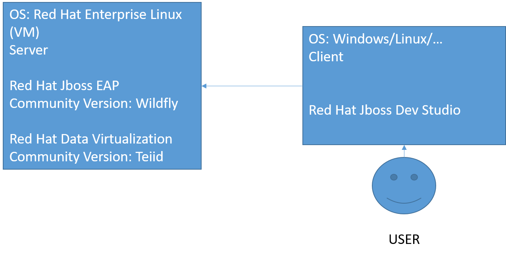

# Dokumentation Teiid Daten Virtualisierung
## Inhaltsverzeichnis
<!-- TOC depthFrom:1 depthTo:6 withLinks:1 updateOnSave:1 orderedList:0 -->

- [Dokumentation Teiid Daten Virtualisierung](#dokumentation-teiid-daten-virtualisierung)
	- [Inhaltsverzeichnis](#inhaltsverzeichnis)
	- [Einleitung](#einleitung)
		- [Verwendete Technologien](#verwendete-technologien)
		- [Grundlagen](#grundlagen)
		- [Kompatibilität](#kompatibilität)
	- [Server aufstezen](#server-aufstezen)

<!-- /TOC -->
## Einleitung
In dieser Dokumentation wird die Installation der Teiid Daten Virtualisierung beschrieben, sowie das Aufsetzen des Servers und das Verbinden mit diversen Datenquellen. Zudem werden generelle Grundlagen der Verwendung des Wildfly Servers und Verwendung der JBoss Developer Studio Oberfläche geklärt. Der Ordner mit benötigten Dateien ist [hier](https://infocloud.infomotion.de/index.php/apps/files/?dir=/Teiid%20Dokumentation&fileid=4750825) zu finden.
### Verwendete Technologien
- **Rechner 1(Server)**
	- OS: [Red Hat Enterprise Linux](https://www.redhat.com/de/technologies/linux-platforms/enterprise-linux)
	- Applikationsserver: [Wildfly](http://www.wildfly.org/)
	- Datenvirtualisierung: [Teiid](http://teiid.io/)
- **Rechner 2(User)**
	- [Red Hat JBoss Developer Studio]((https://developers.redhat.com/products/devstudio/overview/) mit [Teiid Designer](http://teiid.io/tools/teiid_designer/)
	- [Putty](https://www.putty.org/)
	- [FileZilla](https://filezilla-project.org/)

### Grundlagen
Dieses Kapitel beschäftigt sich mit der verwendeten Begriffsterminologie und dem groben Aufbau der Infrastruktur. Für die Datenvirtualisierung wird ein zwei geteiltes System verwendet. Auf der einen Seite befindet sich ein Server (VM oder ein physischer Rechner) und auf der anderen Seite der User mit seiner lokalen Maschine. In diesem Beispiel läuft eine VM auf einem anderen Rechner und wir werden mit [Putty](https://www.putty.org/) auf den Server zugreifen. Auf dem Server läuft das Betriebssystem [Red Hat Enterprise Linux](https://www.redhat.com/de/technologies/linux-platforms/enterprise-linux). Hierfür wird ein Account bei Red Hat benötigt. Auf diser Maschine wird ein Applikationsserver für die Datenvirtualisierung installiert. Hier gibt es zwei Möglichkeiten:

- [JBoss Enterprise Application Plattform](https://developers.redhat.com/products/eap/overview/)  (JBoss EAP)
- [Wildfly](http://www.wildfly.org/)  

Bei EAP handelt es sich um die offizielle Version von Red Hat und bei Wildfly um die Community Version. EAP basiert auf den Komponenten von Wildfly.  
Zusätzlich muss eine Datenvirtualisierung auf diesem Applikationsserver installiert werden. Auch hierbei gibt es wieder zwei Möglichkeiten:

- [JBoss Data Virtualization](https://developers.redhat.com/products/datavirt/overview/)
- [Teiid](http://teiid.io/)

JBoss Data Virtualization die angebotene Version von Red Hat und Teiid die Community Version. JBoss Data Virtualization wird von Red Hat in Zukunft nicht weiter entwickelt und der Support wird eingestellt (Stand: 07.08.2018).
Aus diesem Grund wird im Laufe der Dokumentation ein Wildfly Server mit installiertem Teiid verwendet.

Um eine einfachere Konfiguration der Datenvirtualisierung zu erhalten, wird der [Teiid Designer](http://teiid.io/tools/teiid_designer/) benötigt. Diese Installation ist optional wird jedoch empfohlen. Wir verwenden den Teiid Designer als Plugin für das [Red Hat Developer Studio](https://developers.redhat.com/products/devstudio/overview/).
### Kompatibilität
Ein bestehendes Problem sind die vielen zu Verfügung stehenden Versionen von Teiid und Wildfly, sowie des Teiid Designers. Die neuste Version von Teiid ist 10.2.1 (Stand 07.08.2018) und ist mit Wildfly 11 kompatibel. Die neuste Version von Wildfly ist Wildfly 13, jedoch gibt das hierfür keine Teiid Version. Zudem ist der Teiid Designer 11.1.2 nur vollständig kompatibel und getestet mit Teiid Version 9, was ebenfalls Wildfly 9 benötigt.

| Wildfly | Teiid  | Teiid Designer | Java |
|---------|--------|----------------|------|
| 13      | -      | -              | 1.8  |
| 11      | 10.2.1 | -              | 1.8  |
| 9       | 9.3.7  | 11.1.2         | 1.7  |

Also ergeben sich zwei Möglichkeiten. Entweder es wird Wildfly 9 mit Teiid 9.3.7 und dem Teiid Designer 11.1.2 verwendet. Dies ist eine etwas veraltete Variante, jedoch funktioniert der Teiid Designer vollständig. Oder es wird Wildfly 11 mit Teiid 10.2.1 und ebenfalls dem Teiid Designer 11.1.2, jedoch können hier Probleme mit der Oberfläche im Teiid Designer entstehen und es muss für bestimmte Tasks ggfs. auf die Command-Line gewechselt werden. Die Java Version ist bedingt durch die verwendeten Komponenten und wird bei der späteren Installation eine Rolle spielen.

***Im Folgenden wird Wildfly 11 mit Teiid 10.2.1 und der Teiid Designer 11.1.2 verwendet ***

## Server aufstezen
