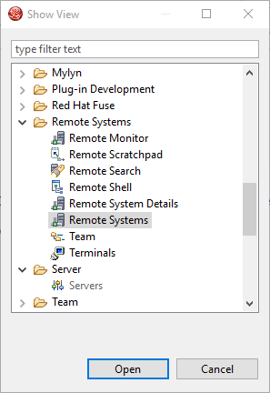

# Dokumentation Teiid Daten Virtualisierung
## Inhaltsverzeichnis
<!-- TOC depthFrom:1 depthTo:6 withLinks:1 updateOnSave:1 orderedList:0 -->

- [Dokumentation Teiid Daten Virtualisierung](#dokumentation-teiid-daten-virtualisierung)
	- [Inhaltsverzeichnis](#inhaltsverzeichnis)
	- [Einleitung](#einleitung)
		- [Verwendete Technologien](#verwendete-technologien)
		- [Grundlagen](#grundlagen)
		- [Kompatibilität](#kompatibilität)
	- [Installation](#installation)
		- [Verbinden per Putty](#verbinden-per-putty)
		- [Verbinden per FileZilla](#verbinden-per-filezilla)
		- [Installieren von Java und Maven](#installieren-von-java-und-maven)
			- [Java](#java)
			- [Maven](#maven)
		- [Wildfly mit Teiid](#wildfly-mit-teiid)
			- [Freigabe von Ports](#freigabe-von-ports)
			- [Erklärung der Ordnerstruktur](#erklärung-der-ordnerstruktur)
				- [bin](#bin)
				- [modules](#modules)
				- [standalone](#standalone)
		- [JBoss Developer Studio mit Teiid Designer](#jboss-developer-studio-mit-teiid-designer)
	- [Benutzung des Applikationsservers](#benutzung-des-applikationsservers)
		- [Verbinden von JBoss Developer Studio mit dem Wildfly-Server](#verbinden-von-jboss-developer-studio-mit-dem-wildfly-server)
		- [User anlegen](#user-anlegen)

<!-- /TOC -->
## Einleitung
In dieser Dokumentation wird die Installation der Teiid Daten Virtualisierung beschrieben, sowie das Aufsetzen des Servers und das Verbinden mit diversen Datenquellen. Zudem werden generelle Grundlagen der Verwendung des Wildfly Servers und Verwendung der JBoss Developer Studio Oberfläche geklärt. Der Ordner mit benötigten Dateien ist [hier](https://infocloud.infomotion.de/index.php/apps/files/?dir=/Teiid%20Dokumentation&fileid=4750825) zu finden.
### Verwendete Technologien
- **Rechner 1(Server)**
	- OS: [Red Hat Enterprise Linux](https://www.redhat.com/de/technologies/linux-platforms/enterprise-linux)
	- Applikationsserver: [Wildfly](http://www.wildfly.org/) (Version 11)
	- Datenvirtualisierung: [Teiid](http://teiid.io/teiid_runtimes/teiid_wildfly/downloads/) (Version 11.0.1)
	- [Java 1.8](https://java.com/de/download/)
- **Rechner 2(User)**
	- [Red Hat JBoss Developer Studio](https://developers.redhat.com/products/devstudio/overview/) mit [Teiid Designer](http://teiid.io/tools/teiid_designer/) (Version 11.1.2)
	- [Putty](https://www.putty.org/)
	- [FileZilla](https://filezilla-project.org/)

### Grundlagen
Dieses Kapitel beschäftigt sich mit der verwendeten Begriffsterminologie und dem groben Aufbau der Infrastruktur. Für die Datenvirtualisierung wird ein zwei geteiltes System verwendet. Auf der einen Seite befindet sich ein Server (VM oder ein physischer Rechner) und auf der anderen Seite der User mit seiner lokalen Maschine. In diesem Beispiel läuft eine VM auf einem anderen Rechner und wir werden mit [Putty](https://www.putty.org/) auf den Server zugreifen. Auf dem Server läuft das Betriebssystem [Red Hat Enterprise Linux](https://www.redhat.com/de/technologies/linux-platforms/enterprise-linux). Hierfür wird ein Account bei Red Hat benötigt. Auf diser Maschine wird ein Applikationsserver für die Datenvirtualisierung installiert. Hier gibt es zwei Möglichkeiten:

- [JBoss Enterprise Application Plattform](https://developers.redhat.com/products/eap/overview/)  (JBoss EAP)
- [Wildfly](http://www.wildfly.org/)  

Bei EAP handelt es sich um die offizielle Version von Red Hat und bei Wildfly um die Community Version. EAP basiert auf den Komponenten von Wildfly.  
Zusätzlich muss eine Datenvirtualisierung auf diesem Applikationsserver installiert werden. Auch hierbei gibt es wieder zwei Möglichkeiten:

- [JBoss Data Virtualization](https://developers.redhat.com/products/datavirt/overview/)
- [Teiid](http://teiid.io/)

JBoss Data Virtualization die angebotene Version von Red Hat und Teiid die Community Version. JBoss Data Virtualization wird von Red Hat in Zukunft nicht weiter entwickelt und der Support wird eingestellt (Stand: 07.08.2018).
Aus diesem Grund wird im Laufe der Dokumentation ein Wildfly Server mit installiertem Teiid verwendet.


Um eine einfachere Konfiguration der Datenvirtualisierung zu erhalten, wird der [Teiid Designer](http://teiid.io/tools/teiid_designer/) benötigt. Diese Installation ist optional wird jedoch empfohlen. Wir verwenden den Teiid Designer als Plugin für das [Red Hat Developer Studio](https://developers.redhat.com/products/devstudio/overview/).
### Kompatibilität
Ein bestehendes Problem sind die vielen zu Verfügung stehenden Versionen von Teiid und Wildfly, sowie des Teiid Designers. Die neuste Version von Teiid ist 11.0.1 (Stand 07.08.2018) und ist mit Wildfly 11 kompatibel. Die neuste Version von Wildfly ist Wildfly 13, jedoch gibt das hierfür keine Teiid Version. Zudem ist der Teiid Designer 11.1.2 nur vollständig kompatibel und getestet mit Teiid Version 9, was ebenfalls Wildfly 9 benötigt.

| Wildfly | Teiid  | Teiid Designer | Java |
|---------|--------|----------------|------|
| 13      | -      | -              | 1.8  |
| 11      | 11.0.1 | -              | 1.8  |
| 9       | 9.3.7  | 11.1.2         | 1.7  |

Also ergeben sich zwei Möglichkeiten. Entweder es wird Wildfly 9 mit Teiid 9.3.7 und dem Teiid Designer 11.1.2 verwendet. Dies ist eine etwas veraltete Variante, jedoch funktioniert der Teiid Designer vollständig. Oder es wird Wildfly 11 mit Teiid 11.0.1 und ebenfalls dem Teiid Designer 11.1.2, jedoch können hier Probleme mit der Oberfläche im Teiid Designer entstehen und es muss für bestimmte Tasks ggfs. auf die Command-Line gewechselt werden. Die Java Version ist bedingt durch die verwendeten Komponenten und wird bei der späteren Installation eine Rolle spielen.

***Im Folgenden wird Wildfly 11 mit Teiid 11.0.1 und der Teiid Designer 11.1.2 verwendet***

## Installation
Dieses Kapitel beschäftigt sich mit der Installation der genannten Komponenten sowie deren Konfiguration zur weiteren Benutzung. Es wird davon ausgegangen, dass bereits ein Server mit dem Betriebssystem [Red Hat Enterprise Linux](https://www.redhat.com/de/technologies/linux-platforms/enterprise-linux) vorliegt. Diese Maschine sollte per SSH zu erreichen sein.
### Verbinden per Putty
Um auf das Filesystem und die Shell des Servers zuzugreifen benötigen wir [Putty](https://www.putty.org/). Installieren Sie dies auf ihrer lokalen Maschine und starten Sie Putty.


Stellen Sie den ***Connection type*** auf ***SSH*** um und tragen Sie in das Feld ***Host Name*** die IP-Adresse des Servers ein sowie den ***Port*** (Standardmäßig Port: 22). Klicken Sie anschließend auf ***Load***.
Nun öffnet sich die Shell des Servers.


Melden Sie sich mit den Benutzerdaten an. Hier ggfs. den Systemadministrator fragen.
### Verbinden per FileZilla
[FileZilla](https://filezilla-project.org/) wird für den Anfang benötigt, um den Ordner mit dem Applikationsserver auf den Server zu verschieben. Hierfür installieren Sie [FileZilla](https://filezilla-project.org/) und starten Sie die Anwendung.

Öffnen Sie über Datei -> Servermanager die Serververwaltung legen Sie einen neuen Server an.


Stellen Sie das ***Protokoll*** auf SFTP um und tragen Sie die IP-Adresse in das Feld ***Server***. Ebenfalls tragen Sie ihren Benutzer und das Passwort in die vorgesehenen Felder ein und klicken Sie auf verbinden. Nun haben Sie Zugriff auf das Filesystem des Servers.

### Installieren von Java und Maven
Java und Maven werden als Installation auf dem Server benötigt, damit Wildlfy und Teiid funktionieren.
#### Java
Dafür verbinden Sie sich per Putty mit dem Server und melden Sie sich an. Sie sind im Home-Verzeichnis des Users, navigieren Sie in das Root-Verzeichnis des Servers mit:
```Shell
cd ..
```
Nun installieren Sie über den bereits vorhandenen Package-Manager yum die benötigte Java Version:

Für Java 1.8
```Shell
yum install java-1.8.0-openjdk-devel
```
oder für Java 1.7
```Shell
yum install java-1.7.0-openjdk-devel
```
Um die Installation zu bestätigen, führen Sie den Befehl

```Shell
/usr/sbin/alternatives --config java
```


und besätigen Sie ihre Auswahl. Liegt nur eine Java Installation vor, enthält die List nur einen Eintrag.
Denselben Vorgang wiederholen Sie für den Befehl
```Shell
/usr/sbin/alternatives --config javac
```
#### Maven
Um [Maven](http://maven.apache.org/download.cgi) zu installieren, downloaden Sie [Maven](http://maven.apache.org/download.cgi) auf ihren lokalen Rechner. Wählen Sie dabei den im bild gezeigten Download-Link unter ***Binary Zip archive***.


und transferieren Sie die Zip-Datei per FileZilla in das Home-Verzeichnis ihres Users (/home/user/apache-maven-3.5.4-bin). Navigieren Sie über Putty in diesem Ordner, entpacken Sie die Zip-Datei und löschen Sie diese anschließend.
```Shell
cd home/user/
unzip apache-maven-3.5.4-bin.zip
rm apache-maven-3.5.4-bin.zip
```
Nun öffnen Sie ihr Bash_Profile mit dem Texteditor vim
```Shell
vi ~/.bash_profile
```
und tragen Sie die Variablen
```Shell
export M2_HOME=/home/user/apache-maven-3.5.4
export M2=$M2_HOME/bin
export PATH=$M2:$PATH
export JAVA_HOME=/usr/lib/jvm/java-1.8.0-openjdk
```
ein. Beispielhaft:


Beenden Sie den Editor, indem Sie ***ESC*** drücken und ***:wq!*** eingeben und mit ***Enter*** bestätigen. Damit die Änderung in Kraft tritt, führen Sie folgenden Befehl aus:
```Shell
source ~/.bash_profile
```
Um die Installation zu überprüfen, geben Sie
```Shell
mvn --version
```
ein.
### Wildfly mit Teiid
[Hier](http://teiid.io/teiid_runtimes/teiid_wildfly/downloads/) [(interner Link)](https://infocloud.infomotion.de/index.php/apps/files/?dir=/Teiid%20Dokumentation&fileid=4750825) finden Sie eine Wildfly 11 Version mit bereits installierem Teiid 11.0.1. Downloaden Sie dafür die Zip-Datei unter dem Link (with Wildfly/Console)


Verschieben Sie diese Datei ebenfalls mit FileZilla in den Home-Ordner ihres Users (/home/user/teiid-11.0.1-wildfly-server.zip) und entpacken bzw. löschen Sie anschließend den Zip-Ordner.

```Shell
unzip teiid-11.0.1-wildfly-server.zip
rm teiid-11.0.1-wildfly-server.zip
```

Fügen Sie in ihr Bash_Profile die Zeile
```Shell
export JBOSS_HOME=/home/user/teiid-11.0.1
```
ein. Benuten Sie eine andere Version, benennen Sie den Pfad dementsprechend. Geben Sie wieder

```Shell
source ~/.bash_profile
```

ein, um die Änderung aktiv werden zu lassen.
Wildfly mit Teiid ist nur erfolgreich auf Ihrem System.
#### Freigabe von Ports
Wildfly ermöglicht die Administration des Servers über eine Weboberfläche. Damit alle Funktionen von Wildfly verwendet werden können, müssen auf dem Server bestimmte Ports freigegeben werden. Führen Sie dafür die Befehle:
```Shell
sudo firewall-cmd --add-port 8787/tcp
sudo firewall-cmd --add-port 9990/tcp
sudo firewall-cmd --add-port 31000/tcp
```
aus. Um die offenen Ports aufzulisten:
```Shell
sudo firewall-cmd --list-ports
```
***8787***
 Wird für Debugzwecke verwendet.
***9990***
Port für Managementservices. Ist dieser Port nicht offen, kann das Developer Studio einen gestarteten Server nicht erkennen und die Weboberfläche ist nicht verfügbar.
***31000***
Dies ist ein Port, der die Schnittstelle zu Teiid bildet. Ist dieser nicht offen, wird keine laufende Instanz von Teiid erkannt.
#### Erklärung der Ordnerstruktur
In diesem Abschnitt gebe ich Ihnen einen kleinen Überblick über die vorhandene Ordnerstruktur und benenne die wesentlichen Dateien, die für die weitere Konfiguration des Wildfly-Servers von Bedeutung sein werden.
Die relevanten Ordner sind ***bin***, ***modules*** und ***standalone***

$ teiid-11.0.1
.
├── ***bin***
│  &nbsp;&nbsp;&nbsp; ├── jboss-cli.sh
│  &nbsp;&nbsp;&nbsp; ├── add-user.sh
│	&nbsp;&nbsp;&nbsp;	├── standalone.sh
│  &nbsp;&nbsp;&nbsp;	├── ...
├── ***modules***
│  &nbsp;&nbsp;&nbsp; └── system
│  &nbsp;&nbsp;&nbsp;&nbsp;&nbsp;&nbsp;&nbsp;&nbsp;&nbsp;&nbsp;&nbsp;&nbsp; 		├── layers
│  &nbsp;&nbsp;&nbsp;&nbsp;&nbsp;&nbsp;&nbsp;&nbsp;&nbsp;&nbsp;&nbsp;&nbsp; 				└── ...
├── ***standalone***
│  &nbsp;&nbsp;&nbsp; └── configuration
│  &nbsp;&nbsp;&nbsp;&nbsp;&nbsp;&nbsp;&nbsp;&nbsp;&nbsp;&nbsp;&nbsp;&nbsp; 		├── standalone-teiid.xml
│  &nbsp;&nbsp;&nbsp;&nbsp;&nbsp;&nbsp;&nbsp;&nbsp;&nbsp;&nbsp;&nbsp;&nbsp; 		├── application-users.properties
│  &nbsp;&nbsp;&nbsp;&nbsp;&nbsp;&nbsp;&nbsp;&nbsp;&nbsp;&nbsp;&nbsp;&nbsp; 		├── application-roles.properties
│  &nbsp;&nbsp;&nbsp;&nbsp;&nbsp;&nbsp;&nbsp;&nbsp;&nbsp;&nbsp;&nbsp;&nbsp; 		├── mgmt-users.properties
│  &nbsp;&nbsp;&nbsp;&nbsp;&nbsp;&nbsp;&nbsp;&nbsp;&nbsp;&nbsp;&nbsp;&nbsp; 		├── mgmt-groups.properties
│  &nbsp;&nbsp;&nbsp;&nbsp;&nbsp;&nbsp;&nbsp;&nbsp;&nbsp;&nbsp;&nbsp;&nbsp; 		└── ...
│  &nbsp;&nbsp;&nbsp; ├── ...
├── ...

Alle hier aufgelisteten Datein und Ordner sind von Relevanz und werden im folgenden näher erklärt.
##### bin
Im ***bin*** Ordner befinden sich die ausführbaren Datein. Die ***jboss-cli.sh*** ist das Skript, mit welchem das ***C***ommand***L***ine***I***nterface des Wildfly-Server aufgerufen werden kann. Genau Benutzung wird später erklärt. ***add-user.sh*** startet das Skript zum Hinzufügen eines Users und ***standalone.sh*** startet den Server.
##### modules
Im ***modules***-Ordner befinden sich alle möglichen Module des Servers. Darunter befinden sich ebenfalls die Treiber für Datenbankschnittstellen, wofür wir diesen Ordner im späteren Verlauf verwenden werden.
##### standalone
Der ***standalone***-Ordner beinhaltet die Configurationsdatei des Servers. Im Unterordner ***confuguration*** befindet sich die Datei ***standalone-teiid.xml***, aus beim Start des Servers die Einstellungen genommen werden. Die ****.properties***-Dateien besitzen Angaben zu den Users, sowie deren Rollen.
### JBoss Developer Studio mit Teiid Designer
Installieren Sie das [JBoss Developer Studio](https://developers.redhat.com/products/devstudio/overview/) [(interner Link)](https://infocloud.infomotion.de/index.php/apps/files/?dir=/Teiid%20Dokumentation&fileid=4750825) auf ihrer lokalen Maschine und downloaden Sie den [teiid-Designer](http://teiiddesigner.jboss.org/designer_summary/downloads) [(interner Link)](https://infocloud.infomotion.de/index.php/apps/files/?dir=/Teiid%20Dokumentation&fileid=4750825). Hierbei handelt es sich um ein Plugin für das JBoss Developer Studio. Öffnen Sie das installierte JBoss Developer Studio und klicken Sie auf den Reiter ***Help*** und klicken Sie auf ***Install new Software...***


In diesem Fenster klicken Sie rechts auf ***Add...***


im geöffneten Fenster klicken Sie auf ***Archive*** und wählen die .zip-Datei des Teiid-Designers, die im vorherigen Schritt heruntergeladen wurde.


Klicken Sie auf ***Öffnen*** und vergeben Sie einen beliebigen Namen


und bestätigen Sie mit ***OK***.


Wählen Sie nun ***Data Virtualization*** aus und klicken Sie auf ***Next***. Die benötigten Komponenten werden nun installiert. Das Developerstudio ist nun erfolgreich installiert.
## Benutzung des Applikationsservers
### Verbinden von JBoss Developer Studio mit dem Wildfly-Server
Wir haben nun den Wildfly-Server auf unserem Server installiert und haben das Developer Studio lokal auf unserem Rechner. Nun verbinden wir das Developer Studio mit unserem Server. Öffnen Sie dafür die ***Remote System***-Ansicht. Diese ist in der Menüleiste unter Window -> Show View -> Other zu finden.



Dort öffnen Sie Remote Systems -> Remote Systems. Legen Sie dort eine neue Verbindung an und wählen Sie ***SSH Only***.


Tragen Sie dort unter ***Host name*** die IP-Adresse des Servers ein und vergeben Sie einen beliebigen ***Connection name***.


Nun haben Sie Zugriff auf das Filesystem ihres Servers über das Developer Studio. Ab diesem Zeitpunkt wird FileZilla nicht mehr benötigt, da alle Filetransfers nun über das Developer Studio stattfinden können. Öffnen Sie nun unter Window -> Perspective -> Open Perspective -> Other... den Teiid Designer.


Am rechten Rand gehen Sie nun auf den Reiter ***Servers***. Legen Sie per Rechtsklick -> new -> Server einen neuen Server an. Wählen Sie in der Kategorie ***JBoss Community*** ihre Serverversion, in unserem Fall Wildfly 11.


Tragen Sie im Feld ***Server's host name*** ihren eben erstellen Host ein und vergeben Sie einen beliebigen ***Server name***.


Nun stellen Sie bei ***The server is*** Remote ein und ***Controlled by*** auf Filesystem and shell operations. Wählen Sie ***Assign a runtime to this server*** ab. Ob ein Haken bei ***Server lifecycle is externally managed*** hängt davon ab, ob Sie den Applikationsserver über das Developer Studio starten wollen oder über die Shell auf dem Server direkt. Es wird ermpfohlen den Haken nicht zu setzen und die letztere Variante zu wählen. Dazu später mehr.
Im nächsten Fenster wählen Sie ihren Host aus und klicken auf ***Browse...*** neben ***Remote Server Home***.


Wählen Sie dort den Home-Server ihres gewählen Applikationsservers aus und bestätigen Sie.


Nun wählen Sie ***Browse...*** hinter ***Remote Server Configuration File***. Navigieren Sie dort in standalone -> configuration und wählen Sie die ***standalone-teiid.xml***.


Und beenden Sie mit ***Finish***.


Nun können Sie im Reiter ***Servers*** ihren konfigurieten Server finden.


Doppelklicken Sie ihren Server, um das Fenster für die Servereinstellungen zu öffnen.


Um sich nun mit dem Wildfly-Server verbinden zu können, muss ein Managementuser erstellt werden, dessen Credentials in ***User Name*** und ***Password*** eingetragen werden.
### User anlegen
Es gibt zwei Arten von Usern:
- Managementuser
- Applikationsuser

Hierfür wird das Skript ***add-user.sh*** verwendet, das früher bereits angesprochen wurde. Managementuser werden für alles verwendet, was mit der Serverkonfiguration zu tun hat und Applikationsuser für alles was mit Teiid und Datenmodellierung zusammenhängt. Wir werden im folgenden für beide Klassen einen User anlegen. Navigieren Sie dafür über die Shell in Putty zum Ordner der die ***add-user.sh*** beinhaltet ($TEIID_HOME/bin) und starten Sie das Skript:
```Shell
sh add-user.sh
```


Wählen Sie dort mit ***a*** einen Management User und geben Sie einen beliebigen Username und Password ein. Überspringen Sie mit Enter die Vergabe einer Gruppe und geben Sie anschließend ***no*** ein. Damit ist ein Managementuser erfolgreich angelegt. Zum anlegen eines Applikationsusers wählen Sie im ersten Schritt ***b*** und folgen Sie den Schritten.
